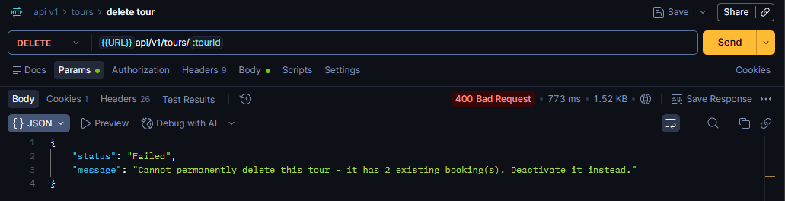
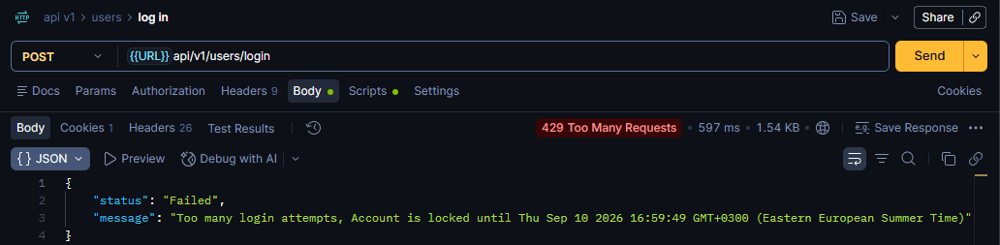
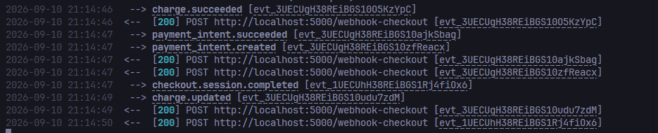
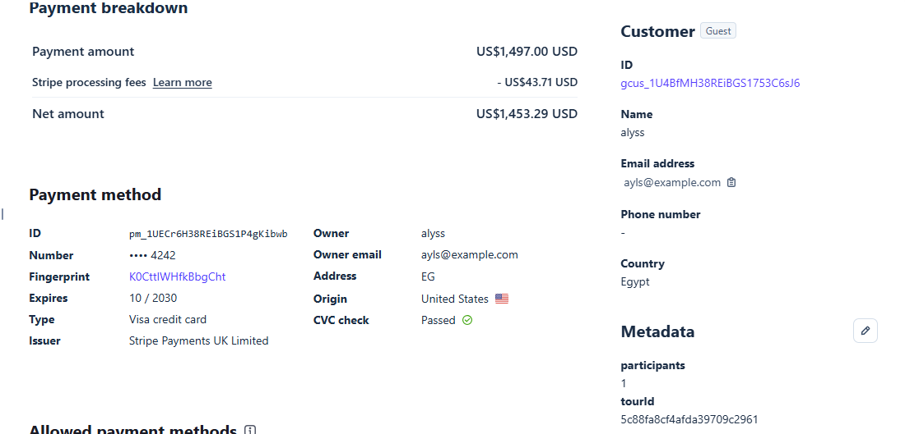
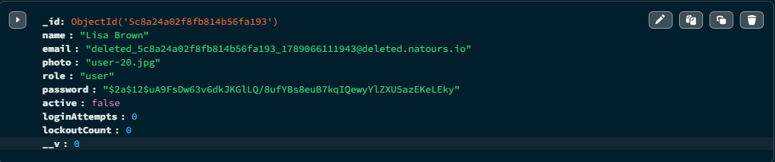
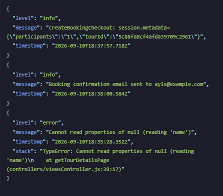

# Natours

A tour booking API and server-rendered web application built with Node.js, Express, and MongoDB. Users can browse tours, book them via Stripe, and manage their account. Admins and guides have role-specific dashboards and controls.

---

## Tech Stack

| Layer | Technology |
|---|---|
| **Backend** | Node.js, Express 5, ES Modules |
| **Templating** | Pug |
| **Database** | MongoDB, Mongoose 9 |
| **Auth** | JWT (HTTP-only cookies), bcryptjs |
| **Payments** | Stripe Checkout (webhooks) |
| **Email** | Brevo HTTP API (production), Mailtrap SMTP (development) |
| **File Uploads** | Multer + Sharp (image resizing) |
| **Security** | Helmet, express-rate-limit, express-mongo-sanitize, hpp, xss-filters |
| **Logging** | Winston |
| **Styles** | SCSS (compiled via Sass) |
| **Deployment** | Render |

---

## Features

- Browse, filter, sort, and paginate tours by price, duration, difficulty, and ratings
- Geospatial queries — find tours within a radius or get distances from a point
- Stripe Checkout with webhook-based booking creation and participant count tracking
- Admin manual booking creation (cash payments) with price override support
- Booking state machine: `pending → confirmed → cancelled / refunded`
- Automatic Stripe refund issued when an admin refunds a Stripe-paid booking
- JWT authentication via HTTP-only cookies, with token invalidation on password change
- Exponential lockout on repeated failed login attempts (15 min → 30 min → 60 min…)
- Role-based access control: `user`, `guide`, `lead-guide`, `admin`
- Lead guides and guides can only modify tours they are assigned to
- Soft delete for both users and tours (`active: false`), with full admin restore
- User self-deletion sets `active: false` (preserves booking history)
- Admin deactivation also obfuscates the email (`deleted_<id>_<ts>@deleted.natours.io`)
- Review creation restricted to `user` role; deletion allowed by author or admin
- Transactional emails: welcome, password reset, booking confirmation, cancellation, refund, account activation
- Photo uploads for users and tour images with server-side resizing via Sharp
- Server-side rendered pages for tour listing, detail, account, bookings, and admin dashboards
- Guide and lead-guide dashboards showing assigned tours and passenger rosters
- Winston-based structured logging with separate `combined.log` and `error.log` files

---

## Project Structure

```
natours/
├── app.js                  # Express app setup, middleware chain, route mounting
├── server.js               # DB connection + server start
├── config/
│   └── index.js            # Centralised config object (reads from .env)
├── controllers/
│   ├── factoryHandler.js   # Generic CRUD factory (getAll, getOne, createOne, updateOne, deleteOne)
│   ├── authController.js   # JWT auth, protect middleware, restrictTo, lockout
│   ├── bookingController.js
│   ├── toursController.js
│   ├── usersController.js
│   ├── reviewController.js
│   ├── viewsController.js
│   └── errorController.js  # Global error handler, operational vs programming errors
├── models/
│   ├── tourModel.js
│   ├── userModel.js
│   ├── bookingModel.js
│   └── reviewModel.js
├── routes/
│   ├── toursRoutes.js
│   ├── userRoutes.js
│   ├── bookingsRoutes.js
│   └── reviewsRoutes.js
├── util/
│   ├── apiFeatures.js      # Chainable filter/sort/paginate/limitFields helper
│   ├── email.js            # Email class: Brevo HTTP API (prod) / Mailtrap SMTP (dev)
│   ├── appError.js         # Operational error wrapper
│   └── logger.js           # Winston logger
├── views/                  # Pug templates
│   └── email/              # Transactional email templates
└── public/                 # Static assets, compiled CSS, client-side JS
```

### Factory Handler Pattern

`FactoryHandler` is a static class that returns Express route handlers for standard CRUD operations. Controllers call it directly instead of repeating boilerplate:

```js
export const getAllUsers = FactoryHandler.getAll(User);
export const getUser    = FactoryHandler.getOne(User, 'userId');
export const createUser = FactoryHandler.createOne(User, ['name', 'email', 'role']);
```

The factory supports optional field whitelisting, custom populate options, base filters (e.g. `{ active: false }` for inactive-only queries), and the `includeInactive` query option to bypass soft-delete middleware.

### Middleware Chain

`app.js` assembles the middleware stack in a deliberate order:

1. CORS, static files, Helmet (CSP configured)
2. **Stripe webhook** — mounted *before* `express.json()` so the raw body is preserved for signature verification
3. `express.json()`, `cookie-parser`
4. MongoDB sanitization, XSS sanitization, HPP, compression
5. Route handlers
6. 404 catch-all → global error handler

---

## API Documentation

### Tours

| Method | Endpoint | Access | Description |
|---|---|---|---|
| `GET` | `/api/v1/tours` | Public | List all active tours (filter, sort, paginate) |
| `GET` | `/api/v1/tours/:tourId` | Public | Get a single tour |
| `POST` | `/api/v1/tours` | Admin, Lead-Guide | Create a tour |
| `PATCH` | `/api/v1/tours/:tourId` | Admin, assigned Lead-Guide | Update a tour |
| `DELETE` | `/api/v1/tours/:tourId` | Admin, assigned Lead-Guide | Hard delete a tour (blocked if bookings exist; must deactivate instead) |
| `PATCH` | `/api/v1/tours/:tourId/deactivate` | Admin, assigned Lead-Guide | Soft deactivate a tour |
| `PATCH` | `/api/v1/tours/:tourId/activate` | Admin, assigned Lead-Guide | Restore a soft-deleted tour |
| `GET` | `/api/v1/tours/top-5` | Public | Top 5 rated tours |
| `GET` | `/api/v1/tours/top-5-cheap` | Public | Top 5 cheapest tours |
| `GET` | `/api/v1/tours/tours-stats` | Public | Aggregated stats by difficulty |
| `GET` | `/api/v1/tours/monthly-plan/:year` | Admin, Guide, Lead-Guide | Bookings per month |
| `GET` | `/api/v1/tours/tours-within/:distance/center/:latlng/unit/:unit` | Public | Tours within radius |
| `GET` | `/api/v1/tours/distances/:latlng/unit/:unit` | Public | Distance from point to each tour |

### Users

| Method | Endpoint | Access | Description |
|---|---|---|---|
| `POST` | `/api/v1/users/signup` | Public | Register a new account |
| `POST` | `/api/v1/users/login` | Public | Login |
| `GET` | `/api/v1/users/logout` | Public | Clears JWT cookie |
| `POST` | `/api/v1/users/forgetPassword` | Public | Send password reset email |
| `PATCH` | `/api/v1/users/resetPassword/:token` | Public | Reset password using token |
| `PATCH` | `/api/v1/users/updatePassword` | Authenticated | Change password |
| `GET` | `/api/v1/users/me` | Authenticated | Get own profile |
| `PATCH` | `/api/v1/users/updateMe` | Authenticated | Update name, email, photo |
| `DELETE` | `/api/v1/users/deleteMe` | Authenticated | Self-deactivate account |
| `GET` | `/api/v1/users` | Admin | List all active users |
| `POST` | `/api/v1/users` | Admin | Create user |
| `GET` | `/api/v1/users/:userId` | Admin | Get user by ID |
| `PATCH` | `/api/v1/users/:userId` | Admin | Update user (name, email, role) |
| `PATCH` | `/api/v1/users/:userId/deactivate` | Admin | Soft deactivate + obfuscate email |
| `PATCH` | `/api/v1/users/:userId/activate` | Admin | Restore account with new email and temp password |

### Bookings

| Method | Endpoint | Access | Description |
|---|---|---|---|
| `GET` | `/api/v1/bookings/checkout-session/:tourId` | User only | Create a Stripe Checkout session |
| `GET` | `/api/v1/bookings` | Admin | List all bookings |
| `POST` | `/api/v1/bookings` | Admin | Create manual (cash) booking |
| `GET` | `/api/v1/bookings/:bookingId` | Admin | Get single booking |
| `PATCH` | `/api/v1/bookings/:bookingId/confirm` | Admin | Confirm a pending booking |
| `PATCH` | `/api/v1/bookings/:bookingId/cancel` | Admin | Cancel a pending/confirmed booking |
| `PATCH` | `/api/v1/bookings/:bookingId/refund` | Admin | Refund a confirmed Stripe booking |
| `POST` | `/webhook-checkout` | Stripe | Stripe webhook — creates booking on payment success |

### Reviews

| Method | Endpoint | Access | Description |
|---|---|---|---|
| `GET` | `/api/v1/tours/:tourId/reviews` | Public | List reviews for a tour |
| `POST` | `/api/v1/tours/:tourId/reviews` | User only | Submit a review |
| `GET` | `/api/v1/reviews/:reviewId` | Public | Get single review |
| `PATCH` | `/api/v1/reviews/:reviewId` | Review author | Update own review |
| `DELETE` | `/api/v1/reviews/:reviewId` | Author or Admin | Delete review |

---

## Getting Started

### Prerequisites

- Node.js v18 or later
- A MongoDB connection string (MongoDB Atlas works fine)
- A [Stripe](https://stripe.com) account (test mode is fine)
- A [Brevo](https://www.brevo.com) account for production email, or a [Mailtrap](https://mailtrap.io) account for development

### 1. Clone and install

```bash
git clone https://github.com/AhmedMahmoud834/natours-app.git
cd natours-app
npm install
```

### 2. Set up environment variables

Create a `.env` file in the project root. See the [Environment Variables](#environment-variables) section below for the full list.

### 3. Compile styles

```bash
npm run sass:build
```

### 4. Run the development server

```bash
npm run start:dev
```

The server starts on `http://localhost:5000` by default.

### 5. (Optional) Forward Stripe webhooks locally

Install the [Stripe CLI](https://stripe.com/docs/stripe-cli) and run:

```bash
stripe listen --forward-to localhost:5000/webhook-checkout
```

Copy the webhook signing secret it prints and set it as `STRIPE_WEBHOOK_SECRET_TEST` in your `.env`.

---

## Environment Variables

Create a `.env` file in the project root with the following variables.

```env
# Server
NODE_ENV=development
PORT=5000

# Database
DATABASE=
DATABASE_PASSWORD=
DATABASE_USER=

# Auth
PASSWORD_SALT=
JWT_SECRET=
JWT_EXPIRES=
JWT_COOKIES_EXPIRES=

# Email — Mailtrap (development)
MAILTRAP_EMAIL_USERNAME=
MAILTRAP_EMAIL_PASSWORD=
MAILTRAP_EMAIL_HOST=
MAILTRAP_EMAIL_PORT=
MAILTRAP_EMAIL_FROM=

# Email — Brevo HTTP API (production)
BREVO_API_KEY=
BREVO_EMAIL_FROM=

# Stripe
STRIPE_SECRET_KEY=
STRIPE_PUBLIC_KEY=
STRIPE_WEBHOOK_SECRET=
STRIPE_WEBHOOK_SECRET_TEST=
```

---

## Deployment

The application is deployed on **Render**.

**Live URL:** https://natours-app-latest.onrender.com

> Note: Render's free tier puts the service to sleep after inactivity. The first request after a sleep period may take 30–60 seconds.

> **Email note:** Render blocks outbound SMTP on the free tier. The production email setup uses the Brevo HTTP API (HTTPS port 443) instead of SMTP to work around this restriction.

---

## System Verification & Previews

> This project is designed as a backend-first REST API. The included server-rendered views (Pug/SCSS) serve as a reference client to demonstrate end-to-end API integration, cookie session management, and asynchronous webhook handling.

### 1. Business Logic & Error Handling

#### Conditional Tour Deletion Guard (`400 Bad Request`)
*Hard deletion is blocked when a tour has existing bookings, protecting payment and booking audit trails:*



#### Exponential Login Lockout (`429 Too Many Requests`)
*Account access is progressively locked after repeated failed login attempts (15 min → 30 min → 60 min…):*



### 2. Stripe Webhook & Async Event Processing

#### Stripe Webhook Lifecycle
*CLI webhook event triggers automatic booking creation and transactional confirmation email dispatch:*



#### Stripe Dashboard Verification
*Payment records verified with custom metadata (`tourId`, `participants`) and customer email association:*



### 3. Data Integrity & Observability

#### Soft Delete & Email Obfuscation (MongoDB Compass)
*Deactivated accounts preserve booking history while obfuscating the email for re-registration:*



#### Structured Observability (Winston Logs)
*Structured JSON logging with timestamps, asynchronous event tracking, and operational error stack traces:*



---

## Design Decisions

### 1. Soft Delete for Users

Users are never hard-deleted. The `deleteMe` endpoint (self-service) sets `active: false`. The admin `deactivateUser` endpoint additionally obfuscates the email, replacing it with `deleted_<userId>_<timestamp>@deleted.natours.io`. This frees the original email address for re-registration while keeping the user record and all their bookings intact in the database.

A Mongoose `pre(/^find/)` hook on `userModel.js` filters out inactive users from all queries by default. Admin endpoints that need to see inactive users pass `{ includeInactive: true }` as a query option to bypass this filter. Accounts can be fully restored via `PATCH /api/v1/users/:userId/activate`, which requires a new email address and sends a temporary password to it.

### 2. Booking State Machine

Bookings have four possible statuses: `pending`, `confirmed`, `cancelled`, and `refunded`. Transitions are one-directional and enforced at the controller level:

- **`pending → confirmed`** via `PATCH /:bookingId/confirm`
- **`pending / confirmed → cancelled`** via `PATCH /:bookingId/cancel` — but only for cash bookings. If a Stripe-paid booking is still marked `paid: true`, the cancel endpoint returns a `400` directing the admin to use `/refund` instead, so the customer actually gets their money back.
- **`confirmed → refunded`** via `PATCH /:bookingId/refund` — triggers a Stripe API refund call for Stripe bookings; for cash bookings it only updates the status and `paid` flag.

There is no path back from `cancelled` or `refunded`. Stripe Checkout bookings are created directly in `confirmed` state via the webhook.

### 3. Tour Capacity — Per-Booking Cap Only

`maxGroupSize` is enforced strictly as a **per-booking cap**: a single booking's `participants` value cannot exceed the tour's `maxGroupSize` (checked when initiating a Stripe Checkout session and during manual booking creation).

There is **no tracking of remaining or total capacity** across all bookings for a tour or date — multiple separate bookings can each individually satisfy the per-booking cap even if their combined participants would exceed `maxGroupSize` many times over.

This was a deliberate middle-ground decision: it prevents an obviously invalid single booking (e.g. 1,000 participants on a 15-person tour) without requiring ongoing slot-tracking maintenance across bookings/dates (such as inventory locks, date availability calculations, and replenishing slots upon cancellation).

### 4. Role-Based Permissions with Tour Scoping

Four roles exist: `user`, `guide`, `lead-guide`, and `admin`. Route-level access is controlled by the `restrictTo(...roles)` middleware in `authController.js`.

Beyond role checks, `lead-guide` and `guide` users can only modify tours they are explicitly assigned to. The `restrictToOwnTour` middleware checks that `req.user.id` is present in `tour.guides` before allowing `PATCH`, `DELETE`, `deactivate`, or `activate` on a tour. Admins bypass this check. Review creation is restricted to `user` role only — `guide`, `lead-guide`, and `admin` roles cannot submit reviews.

### 5. Review Moderation

Admins can delete any review. Review authors can delete and update their own reviews. Admins cannot edit reviews — only delete them. This keeps admin moderation limited to removing content that violates policy, rather than allowing silent alteration of what users wrote.

### 6. Tour Deletion vs. Deactivation (Preserving Booking History)

Admins and assigned lead-guides cannot permanently delete a tour if it has any associated bookings. Before deletion, `deleteTour` queries `Booking.find({ tour: tour.id })`. If any bookings exist, the request is rejected with a `400 Bad Request` status and the message:

> `"Cannot permanently delete this tour - it has <count> existing booking(s). Deactivate it instead."`

Permanent hard deletion (`DELETE /api/v1/tours/:tourId`) is only permitted when a tour has zero associated bookings. This exists to protect referential integrity and prevent losing payment, customer, and booking history records. Once a tour has bookings tied to it, admins and assigned lead-guides must use `PATCH /api/v1/tours/:tourId/deactivate` to soft-delete the tour (`active: false`), hiding it from public listings and queries while keeping all historical records intact.
